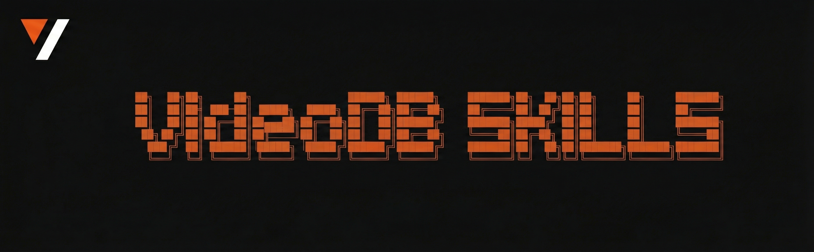

[](https://github.com/video-db/skills/stargazers)
[](https://videodb.io)

<div align="center">



**Talk to your videos using natural language. Upload, search, edit, generate subtitles, create clips, and more.**

Built on the [VideoDB Python SDK](https://github.com/video-db/videodb-python) and [VideoDB Capture SDK](https://github.com/video-db/videodb-capture-quickstart)

Works with **Claude Code**, **Cursor**, **Copilot**, and other AI agents

---

**[📚 Explore the Docs](https://docs.videodb.io)**

</div>

---

## What You Can Do

| Capability | Description |
|---|---|
| **Upload** | Ingest videos from YouTube, URLs, or local files |
| **Search** | Find moments by what was said (speech) or what was shown (scenes) |
| **Transcripts** | Generate timestamped transcripts from any video |
| **Edit** | Combine clips, trim, add text/image/audio overlays |
| **Subtitles** | Auto-generate and style subtitles |
| **AI Generate** | Create images, video, music, sound effects, and voiceovers from text |
| **Meetings** | Record meetings, extract transcripts, get summaries and action items |
| **Capture** | Record screen, mic, and system audio in real-time with AI transcription and indexing |
| **Transcode / Reframe** | Change resolution, quality, aspect ratio, or reframe for social platforms — all server-side |
| **Stream** | Get playable HLS links for anything you build |

---

## Prerequisites

- **Python 3.9+**
- **An AI coding agent** (Claude Code, Cursor, Copilot, etc.)
- **VideoDB API key** — sign up free at [console.videodb.io](https://console.videodb.io)
  - $20 free credits
  - No credit card required

**Supported Platforms:** macOS, Linux, Windows (PowerShell)

---

## Installation

### Option 1: npx (Recommended)

Install for multiple AI coding assistants (Claude Code, Cursor, Copilot, etc.):

```bash
npx skills add video-db/skills
```

### Option 2: Claude Code Plugin

**Step 1:** Open Claude Code and in the chat interface, type:
```bash
/plugin marketplace add video-db/skills
```
Wait for this to complete, then continue to Step 2.

**Step 2:** In the Claude Code chat, type:
```bash
/plugin install videodb@videodb-skills
```

---

## Quick Start

### Step 1: Get your VideoDB API key

Sign up free at **[console.videodb.io](https://console.videodb.io)** — $20 free credits, no credit card required.

Copy your API key — you'll need it in the next step.

### Step 2: Set up the environment

Ask your agent to set up VideoDB. It will prompt for your API key, install the SDK, and verify the connection.

### Step 3: Start using it

Just describe what you want in natural language. The skill loads automatically when the task involves video processing.

*"Upload https://www.youtube.com/watch?v=VIDEO_ID and give me a transcript"*

### Example prompts

- *"Search for 'product demo' in my latest video"*
- *"Add subtitles to my video with white text on black background"*
- *"Take clips from 10s-30s and 45s-60s, add a title card, and combine them"*
- *"Generate 30 seconds of background music and overlay it on my video"*
- *"Capture my screen and transcribe it in real-time"*

---

## Documentation

| Guide | What's Inside |
|---|---|
| [SKILL.md](./python/SKILL.md) | Skill definition and quick reference |
| [api-reference.md](./python/reference/api-reference.md) | Complete API reference for all objects and methods |
| [search.md](./python/reference/search.md) | Semantic, keyword, and scene-based search |
| [editor.md](./python/reference/editor.md) | Timeline editing with overlays, limitations |
| [generative.md](./python/reference/generative.md) | AI-generated images, video, music, voice, and text |
| [meetings.md](./python/reference/meetings.md) | Meeting recording, transcription, and analysis |
| [rtstream.md](./python/reference/rtstream.md) | Real-time HLS streaming |
| [capture.md](./python/reference/capture.md) | Real-time capture architecture and AI pipelines |
| [use-cases.md](./python/reference/use-cases.md) | End-to-end workflow examples |

---

## Contributing

1. Fork this repository
2. Create a feature branch (`git checkout -b feature/my-feature`)
3. Commit your changes (`git commit -m "Add my feature"`)
4. Push to the branch (`git push origin feature/my-feature`)
5. Open a Pull Request

---

## License

This plugin is provided as-is for use with Claude. The VideoDB SDK is governed by its own [license](https://github.com/video-db/videodb-python/blob/main/LICENSE).

---

## Community & Support

- **VideoDB SDK Issues:** [github.com/video-db/videodb-python/issues](https://github.com/video-db/videodb-python/issues)
- **VideoDB Capture Issues:** [github.com/video-db/videodb-capture-quickstart/issues](https://github.com/video-db/videodb-capture-quickstart/issues)
- **Documentation:** [docs.videodb.io](https://docs.videodb.io)
- **Discord:** [Join our community](https://discord.com/invite/py9P639jGz)

---

<div align="center">

Made with ❤️ by the VideoDB team

</div>
